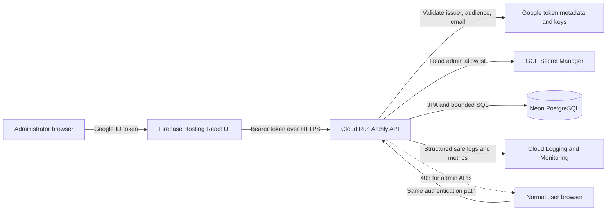
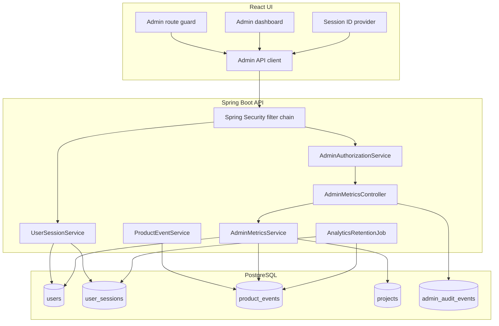
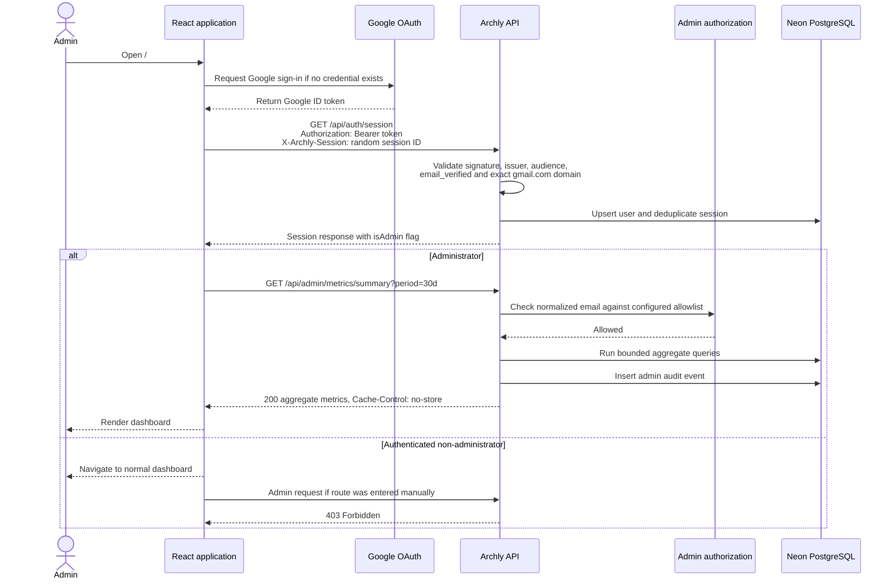
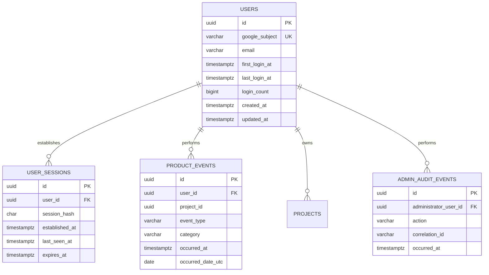

# V3 Product Analytics and Administration Requirements

Status: Groomed

Version: 3.0

Last updated: 2026-08-29

Parent roadmap: [Archly V3 requirements](requirements-v3.md)

This document is the authoritative, implementation-ready specification for the
V3 product analytics and administration area. The V3 roadmap contains only a
summary and link to avoid maintaining duplicate requirements.

## 1. Objective and scope

Archly needs a small, privacy-conscious administration capability that answers
two initial business questions accurately:

1. How many people have successfully used Archly?
2. How many diagrams have they created?

Google OAuth authentication by itself is not an Archly user register. A user is
therefore recorded only after the backend has successfully validated the Google
token and the UI calls the Archly session endpoint. Failed and rejected sign-in
attempts never create users.

This capability is product analytics, not employee surveillance. It must not
capture document text, canvas data, project names, component names, IP addresses,
OAuth tokens, share tokens, or exported content.

## 2. Metric definitions

| Metric | Definition |
| --- | --- |
| Observed user | A unique, successfully authenticated Google identity recorded by Archly. |
| Successful login | One successful session establishment. Token refreshes and repeated API requests within the same browser session do not count as additional logins. |
| Active user | A unique observed user who performs at least one authenticated product action during the selected UTC period. Passive health checks and rejected requests are excluded. |
| New user | An observed user whose first successful login occurred during the selected UTC period. |
| Diagram | One project record, including an archived project. A duplicated project is a new diagram. |
| Active diagram | A non-deleted project that was created or content-modified during the selected UTC period. Selection, viewport, hover, or focus changes are excluded. |
| Deleted diagram | A diagram deletion event. Deleted records are excluded from the current total but included in historical creation and deletion counts. |
| Conversion to first diagram | A user who creates a first diagram within 24 hours of first login. |
| Conversion to first save | A user whose first diagram completes a successful content save within 24 hours of first login. |

All daily, weekly, and monthly boundaries use UTC. The administrator UI must
display that timezone and must not silently use the browser timezone.

## 3. Functional requirements

| ID | Priority | Requirement |
| --- | --- | --- |
| V3-ANA-001 | Must | After successful token validation and session establishment, Archly creates or updates exactly one user record using the Google `sub` claim as the stable identity. |
| V3-ANA-002 | Must | The user record contains an internal ID, Google subject identifier, normalized verified email, first-login time, last-login time, login count, created time, and updated time. |
| V3-ANA-003 | Must | Token refreshes and ordinary authenticated API requests do not inflate the login count. The client supplies a random session identifier that is deduplicated server-side. |
| V3-ANA-004 | Must | Archly records privacy-safe events for session establishment, project creation, successful content save, archive, restore, duplicate, and delete. |
| V3-ANA-005 | Must | The current diagram total is calculated from project records; historical creation and deletion trends are calculated from immutable events so deletion does not rewrite history. |
| V3-ANA-006 | Must | The administrator dashboard reports current users, new users, daily/weekly/monthly active users, current diagrams, archived diagrams, diagrams created, diagrams deleted, and diagrams per active user. |
| V3-ANA-007 | Must | The dashboard supports fixed periods of 24 hours, 7 days, 30 days, and 90 days and displays the start, end, and UTC timezone. |
| V3-ANA-008 | Must | The dashboard shows time-series charts for new users, active users, diagram creation, and diagram deletion. |
| V3-ANA-009 | Must | The dashboard reports conversion to first diagram and first successful save using the definitions in Section 1.2. |
| V3-ANA-010 | Must | An administrator can refresh the dashboard and can export aggregate metrics as CSV; individual user email addresses are not included in the export. |
| V3-ANA-011 | Should | Administrators can inspect a paginated user list containing masked email, first login, last login, and aggregate project count. |
| V3-ANA-012 | Should | The dashboard reports save failures, conflicts, exports, shares, template use, and the most frequently used component types using bounded categorical values. |
| V3-ANA-013 | Should | The dashboard compares the selected period with the immediately preceding period. |

## 4. Administration and authorization

| ID | Priority | Requirement |
| --- | --- | --- |
| V3-ADM-001 | Must | All `/api/admin/**` endpoints require a valid supported Gmail identity and an administrator role enforced by the backend. Hiding UI controls is not authorization. |
| V3-ADM-002 | Must | Initial administrator membership is configured through a normalized server-side email allowlist stored outside source control. |
| V3-ADM-003 | Must | An empty or missing production administrator allowlist grants access to nobody and causes a clear startup warning without exposing its configured values. |
| V3-ADM-004 | Must | Non-administrators receive `403 Forbidden`; unauthenticated callers receive `401 Unauthorized`; neither response discloses metric data or the administrator list. |
| V3-ADM-005 | Must | Administrator metric access is recorded with administrator internal ID, action, timestamp, and correlation ID, without recording returned metric contents. |
| V3-ADM-006 | Must | Administrative responses use `Cache-Control: no-store` and are never available through public share endpoints. |
| V3-ADM-007 | Should | The allowlist can later be replaced by persisted roles without changing the administrator API contract. |

## 5. Data and privacy requirements

| ID | Priority | Requirement |
| --- | --- | --- |
| V3-PRV-001 | Must | Analytics never store document HTML, canvas JSON, project names, component or connection labels, OAuth tokens, share tokens, exported content, or raw request bodies. |
| V3-PRV-002 | Must | Event properties use an explicit allowlist of bounded identifiers and categories; arbitrary client-provided property maps are rejected. |
| V3-PRV-003 | Must | Google subject identifiers and email addresses are encrypted or protected using the database and secret-management controls documented for production. |
| V3-PRV-004 | Must | Aggregate queries do not expose a row for a cohort smaller than the configured privacy threshold; the initial threshold is five users. |
| V3-PRV-005 | Must | Raw product events are retained for 90 days. Daily aggregate metrics may be retained for 25 months. Cleanup runs automatically and is observable. |
| V3-PRV-006 | Must | Removing a user removes or irreversibly anonymizes direct identity data while preserving non-identifying aggregate totals. |
| V3-PRV-007 | Must | Analytics collection and retention are described in the privacy policy before production collection begins. |
| V3-PRV-008 | Should | Email is used for display and the initial administrator allowlist only; joins and metric aggregation use the internal user ID. |

## 6. API and data-contract requirements

| ID | Priority | Requirement |
| --- | --- | --- |
| V3-API-ANA-001 | Must | `GET /api/admin/metrics/summary` returns aggregate metrics for an allowed fixed period. |
| V3-API-ANA-002 | Must | `GET /api/admin/metrics/timeseries` returns bounded daily buckets for one supported metric and period. |
| V3-API-ANA-003 | Must | `GET /api/admin/users` returns a paginated, size-bounded user summary and never returns Google subject identifiers. |
| V3-API-ANA-004 | Must | `GET /api/admin/metrics/export` returns the same authorized aggregate data as CSV and applies rate and response-size limits. |
| V3-API-ANA-005 | Must | Metric endpoints validate the requested metric, period, page, and size and reject unknown or unbounded queries with `400 Bad Request`. |
| V3-API-ANA-006 | Must | Product-event writes occur through trusted backend service operations. The browser cannot submit arbitrary event names or choose another user or project identity. |
| V3-API-ANA-007 | Must | Analytics failures do not prevent authentication, project editing, saving, or deletion; failures are logged safely and monitored. |

The initial schema should separate `users`, deduplicated `user_sessions`, and
append-only `product_events`. Project ownership should migrate from email to the
internal user ID in a separately tested migration; compatibility must be
preserved during rollout.

## 7. Quality and acceptance criteria

| ID | Priority | Requirement |
| --- | --- | --- |
| V3-QA-ANA-001 | Must | Unit tests verify UTC boundaries, unique-user counting, session deduplication, conversion windows, archived totals, and deletion history. |
| V3-QA-ANA-002 | Must | Integration tests prove that unauthenticated and non-administrator users cannot access any administrator endpoint. |
| V3-QA-ANA-003 | Must | Cross-owner tests prove that analytics cannot be used to retrieve another user's project content or identity claims. |
| V3-QA-ANA-004 | Must | Browser tests verify administrator navigation, all time filters, empty-state behavior, CSV export, and `403` behavior for a normal user. |
| V3-QA-ANA-005 | Must | A reconciliation test creates, duplicates, archives, restores, and deletes known projects and proves dashboard totals against the database records and event history. |
| V3-QA-ANA-006 | Must | Load testing proves summary and 90-day time-series requests meet the documented API latency target without scanning project content columns. |
| V3-QA-ANA-007 | Must | Logs and test captures are scanned to prove that tokens, raw emails, document HTML, canvas JSON, and project names are absent. |

Section 1 is accepted when two users can establish multiple sessions and create,
duplicate, archive, restore, modify, and delete known projects, and the dashboard
reports the expected user, activity, conversion, and diagram totals for every
supported period. A normal user must be unable to access the dashboard or its
APIs, and analytics unavailability must not interrupt the core product.

## 8. Technical architecture

### 8.1 Deployment view

The administration capability uses the existing Archly deployment. It does not
introduce a second backend, analytics vendor, or public database connection.



Firebase Hosting serves the administrator route, but it is not the security
boundary. Cloud Run validates the token and administrator membership on every
administrator request. Neon remains private to the backend.

### 8.2 Logical component view



## 9. Administrator access flow

### 9.1 First administrator visit



### 9.2 Access decision rules

The access decision is deny-by-default and is evaluated in this order:

1. Reject a missing or malformed bearer token with `401`.
2. Validate the Google signature, issuer, configured OAuth audience, expiry,
   `email_verified=true`, and exact normalized `gmail.com` domain.
3. Resolve the authenticated email from the validated token only. Never accept
   an email, role, or administrator flag from request parameters or browser
   storage.
4. Normalize the email using trim and lower-case rules already used by the
   identity validator.
5. Compare it with the parsed server-side allowlist using exact equality.
6. Return `403` when the identity is valid but not an administrator.
7. Execute and audit the administrator operation only after authorization.

The UI may use `isAdmin` to control navigation, but a manipulated value cannot
grant access because every `/api/admin/**` call repeats backend authorization.

### 9.3 Session establishment and login counting

The UI creates a cryptographically random 128-bit session identifier and stores
it in `sessionStorage`, not `localStorage`. It sends the value only to the
authenticated session endpoint in `X-Archly-Session`.

The backend stores only a SHA-256 hash of that identifier. A unique constraint
on `(user_id, session_hash)` makes retrying the session call idempotent. A new
row increments `login_count`; an existing row only updates `last_seen_at`.
Expired OAuth tokens, token refreshes, page API traffic, and failed Gmail checks
do not increment the count.

## 10. Database low-level design

### 10.1 Entity relationship model



### 10.2 Proposed Flyway migration artifacts

The exact migration numbers must use the next available repository sequence at
implementation time.

| Artifact | Purpose |
| --- | --- |
| `Vnext__create_users_and_sessions.sql` | Create `users` and `user_sessions`, constraints, and indexes. |
| `Vnext__create_product_events.sql` | Create the append-only allowlisted product-event store. |
| `Vnext__create_admin_audit_events.sql` | Create administrator access audit records. |
| `Vnext__link_projects_to_users.sql` | Add nullable `owner_user_id`, backfill it, validate ownership, then enforce the foreign key. |
| `Vnext__finalize_project_user_ownership.sql` | Make `owner_user_id` mandatory only after compatibility deployment and reconciliation. |

### 10.3 Proposed relational constraints and indexes

```sql
create unique index uq_users_google_subject on users (google_subject);
create unique index uq_users_normalized_email on users (lower(email));
create unique index uq_user_sessions_identity
    on user_sessions (user_id, session_hash);
create index idx_product_events_type_time
    on product_events (event_type, occurred_at desc);
create index idx_product_events_user_time
    on product_events (user_id, occurred_at desc);
create index idx_product_events_project_time
    on product_events (project_id, occurred_at desc)
    where project_id is not null;
create index idx_projects_owner_user_updated
    on projects (owner_user_id, updated_at desc);
create index idx_admin_audit_time
    on admin_audit_events (occurred_at desc);
```

`event_type` is validated both by application code and a database check
constraint. Initial allowed values are:

- `SESSION_ESTABLISHED`
- `PROJECT_CREATED`
- `PROJECT_DUPLICATED`
- `PROJECT_CONTENT_SAVED`
- `PROJECT_ARCHIVED`
- `PROJECT_RESTORED`
- `PROJECT_DELETED`

Events contain identifiers and bounded categories only. They do not contain a
JSON property bag in the first implementation.

### 10.4 Ownership migration

Existing projects are owned by normalized email. Migration must not guess when
identity mapping is ambiguous.

1. Deploy `users` while retaining `projects.owner_email` as the authorization
   source.
2. On the next successful session, create the user and link projects whose
   normalized owner email exactly matches the verified token email.
3. Write both `owner_email` and `owner_user_id` during the compatibility period.
4. Run reconciliation that reports unlinked and multiply matched records.
5. Switch authorization queries to `owner_user_id` only after reconciliation is
   clean and cross-owner tests pass.
6. Retain or remove `owner_email` only through a later reviewed migration.

## 11. Backend low-level design

### 11.1 Proposed package and class artifacts

| Path | Responsibility |
| --- | --- |
| `io.archly.user.ArchlyUser` | JPA user entity; never returned directly by controllers. |
| `io.archly.user.UserRepository` | Lookup by Google subject and normalized email. |
| `io.archly.user.UserSession` | Hashed, deduplicated session entity. |
| `io.archly.user.UserSessionRepository` | Atomic session insert and last-seen update. |
| `io.archly.user.UserSessionService` | Establish session and update login aggregates transactionally. |
| `io.archly.analytics.ProductEvent` | Append-only analytics event entity. |
| `io.archly.analytics.ProductEventType` | Closed event enum. |
| `io.archly.analytics.ProductEventService` | Trusted internal event recording methods. |
| `io.archly.admin.AdminAuthorizationService` | Parse allowlist and make exact access decisions. |
| `io.archly.admin.AdminMetricsController` | Bounded REST endpoints and `no-store` responses. |
| `io.archly.admin.AdminMetricsService` | UTC periods, aggregates, privacy threshold, and CSV generation. |
| `io.archly.admin.AdminMetricsRepository` | Projection-based aggregate SQL; never loads content columns. |
| `io.archly.admin.AdminAuditService` | Record administrator metric access. |
| `io.archly.analytics.AnalyticsRetentionJob` | Delete expired sessions/events and expose cleanup outcome. |

### 11.2 Security integration

Add an administrator authorization rule after the existing resource-server JWT
validation. Prefer a Spring Security authorization manager or method security
that is applied to `/api/admin/**` in one place. Do not duplicate controller
email checks.

The session response becomes a typed DTO such as:

```json
{
  "email": "admin@gmail.com",
  "isAdmin": true
}
```

The value helps UI routing only. The backend does not accept it back as proof.

### 11.3 Transaction boundaries and event reliability

Project mutation and its corresponding event are written in the same database
transaction. This prevents a project from being created without its creation
event or an event from claiming a mutation that rolled back.

Analytics must not make the core product unavailable. This is achieved without
swallowing inconsistent transactional writes:

- Business event persistence inside a successful project transaction is
  mandatory and lightweight.
- Administrator aggregate read failures return a safe `503` only for the admin
  endpoint; they do not affect editor endpoints.
- Optional operational counters and logs are best-effort.
- No network analytics vendor appears in a project transaction.

### 11.4 Query rules

- Use DTO projections and aggregate SQL; never load `canvas_json` or `markdown`.
- Accept only fixed period values: `24h`, `7d`, `30d`, and `90d`.
- Cap user-list page size at 100 and default it to 25.
- Cap time-series output at 90 daily buckets.
- Use `Clock` injection so UTC windows are deterministic in tests.
- Count distinct internal user IDs, never emails.
- Use half-open intervals: `occurred_at >= start AND occurred_at < end`.
- Apply the cohort privacy threshold to dimensioned breakdowns, not the global
  headline totals requested by the administrator.

## 12. REST API contracts

### 12.1 Summary

`GET /api/admin/metrics/summary?period=30d`

```json
{
  "period": "30d",
  "timezone": "UTC",
  "start": "2026-07-30T00:00:00Z",
  "end": "2026-08-29T00:00:00Z",
  "users": {
    "total": 42,
    "new": 8,
    "active": 21
  },
  "diagrams": {
    "current": 96,
    "archived": 7,
    "created": 25,
    "deleted": 3,
    "perActiveUser": 1.19
  },
  "conversion": {
    "firstDiagramPercent": 71.4,
    "firstSavePercent": 66.7
  }
}
```

### 12.2 Time series

`GET /api/admin/metrics/timeseries?metric=active-users&period=30d`

```json
{
  "metric": "active-users",
  "timezone": "UTC",
  "buckets": [
    { "date": "2026-08-28", "value": 6 },
    { "date": "2026-08-29", "value": 9 }
  ]
}
```

Allowed metric values are `new-users`, `active-users`, `diagrams-created`, and
`diagrams-deleted`. Unknown metrics or periods return a structured `400` error.

### 12.3 User summaries

`GET /api/admin/users?page=0&size=25&sort=lastLogin,desc`

```json
{
  "items": [
    {
      "id": "82ae4ed7-35c5-4e32-a7be-1af6a34140db",
      "maskedEmail": "v***@gmail.com",
      "firstLoginAt": "2026-08-10T09:20:00Z",
      "lastLoginAt": "2026-08-29T06:15:00Z",
      "projectCount": 4
    }
  ],
  "page": 0,
  "size": 25,
  "totalItems": 1,
  "totalPages": 1
}
```

This endpoint never returns `google_subject`, tokens, project names, document
content, or canvas content.

### 12.4 Error contract

| Condition | Status | Code |
| --- | --- | --- |
| Missing or invalid token | `401` | `AUTHENTICATION_REQUIRED` |
| Valid non-admin identity | `403` | `ADMIN_ACCESS_REQUIRED` |
| Invalid period, metric, page, or size | `400` | `INVALID_ANALYTICS_QUERY` |
| Aggregate query unavailable | `503` | `ANALYTICS_UNAVAILABLE` |
| Unexpected correlation-safe error | `500` | `INTERNAL_ERROR` |

Error responses include the correlation ID but never expose SQL, allowlist
values, identity claims, or stack traces.

## 13. Frontend low-level design

### 13.1 Proposed artifacts

| Path | Responsibility |
| --- | --- |
| `ui/src/admin/AdminDashboard.tsx` | Page composition and accessible loading/error/empty states. |
| `ui/src/admin/adminApi.ts` | Typed administrator API calls using the existing bearer-token client. |
| `ui/src/admin/adminTypes.ts` | Summary, series, pagination, period, and error contracts. |
| `ui/src/admin/useAdminMetrics.ts` | Fetch, cancellation, refresh, and period state. |
| `ui/src/admin/MetricCard.tsx` | Accessible metric value and comparison display. |
| `ui/src/admin/MetricChart.tsx` | Time series with text/table alternative. |
| `ui/src/admin/UserSummaryTable.tsx` | Paginated masked-user summaries. |
| `ui/src/auth/sessionId.ts` | Generate and retain the per-tab random session identifier. |

The administrator route is lazy-loaded so normal users do not download chart or
CSV-related code. The account menu displays Admin only when the session response
says `isAdmin=true`.

### 13.2 UI states

The dashboard must explicitly render:

- Loading skeleton with an accessible status message.
- Empty state when no activity exists in the selected period.
- Loaded state with cards, charts, UTC period, and last refresh time.
- Forbidden state that returns the user to the normal dashboard.
- Retryable unavailable state for `503` or network failure.
- Session-expired state that invokes the existing sign-in flow.

The UI does not cache metric payloads in `localStorage`. In-memory results may be
retained only for the current page session and are cleared on logout.

## 14. Configuration and secret artifacts

### 14.1 Backend configuration

```yaml
archly:
  admin:
    emails: ${ARCHLY_ADMIN_EMAILS:}
  analytics:
    enabled: ${ARCHLY_ANALYTICS_ENABLED:true}
    raw-event-retention-days: ${ARCHLY_ANALYTICS_RETENTION_DAYS:90}
    session-retention-days: ${ARCHLY_SESSION_RETENTION_DAYS:90}
    privacy-threshold: ${ARCHLY_ANALYTICS_PRIVACY_THRESHOLD:5}
```

Production `ARCHLY_ADMIN_EMAILS` is supplied from GCP Secret Manager to Cloud
Run. Local development defaults to no administrator. A developer must explicitly
set a local Gmail address; the development authentication bypass does not
implicitly grant administrator access.

### 14.2 Deployment artifacts

| Artifact | Required change |
| --- | --- |
| GCP Secret Manager | Add `archly-admin-emails`; value is a comma-separated normalized allowlist. |
| Runtime service account | Grant Secret Accessor only for the administrator secret. |
| Cloud Run deployment | Mount the secret as `ARCHLY_ADMIN_EMAILS`. |
| GitHub workflow | Pass only the secret resource name if needed; never store the email list in repository variables or logs. |
| Deployment documentation | Add administrator grant, removal, rotation, verification, and emergency revocation steps. |

## 15. Retention and cleanup design

The daily retention job runs under a PostgreSQL advisory lock so only one Cloud
Run instance performs cleanup. It deletes in bounded batches and records counts
and duration as operational metrics.

Cleanup order:

1. Expire session rows older than the configured session retention.
2. Delete raw product events older than 90 days after daily aggregates, if
   introduced, have been successfully materialized.
3. Retain administrator audit events according to the security audit policy;
   they are not deleted by the product-event job.
4. Emit a safe completion metric and alert after repeated failures.

The first implementation may calculate 90-day metrics directly from indexed raw
events. A `daily_product_metrics` table should be added only after query
measurement demonstrates the need or retention requires longer aggregate history.

## 16. Technical test artifacts

### 16.1 Backend tests

| Test artifact | Required coverage |
| --- | --- |
| `AdminAuthorizationServiceTest` | Case normalization, exact matches, empty allowlist, malformed entries, and no value leakage. |
| `UserSessionServiceTest` | First login, retry deduplication, new browser session, token refresh exclusion, and concurrent insertion. |
| `AdminMetricsServiceTest` | UTC boundaries, half-open intervals, zero denominators, conversion windows, archive and delete semantics. |
| `AdminMetricsControllerTest` | `401`, `403`, `400`, `503`, `no-store`, pagination, response schema, and CSV safety. |
| `ProductEventIntegrationTest` | Transaction rollback, allowed event types, ownership, and absence of content fields. |
| `AdminMetricsReconciliationTest` | Known lifecycle events exactly match current and historical totals. |
| `AnalyticsRetentionJobTest` | Advisory lock, cutoff boundaries, batching, retry, and audit-event exclusion. |

### 16.2 Frontend and browser tests

| Test artifact | Required coverage |
| --- | --- |
| Admin dashboard component tests | Loading, empty, data, forbidden, unavailable, refresh, and UTC labels. |
| Admin route Playwright test | Admin link visibility, direct URL access, successful dashboard load, and normal-user denial. |
| Session counting Playwright test | Reload same tab, open new tab, token refresh, logout/login, and expected login totals. |
| CSV Playwright test | Authorized download, headers, aggregate-only values, escaping, and no raw email. |
| Accessibility test | Axe scan, keyboard period selection, chart alternative, table navigation, and status announcements. |

### 16.3 Security tests

- Modify the UI `isAdmin` value and prove the API still returns `403`.
- Attempt case, whitespace, suffix, Unicode, and look-alike email bypasses.
- Attempt to send arbitrary events, another user ID, or another project ID.
- Verify administrator responses are not cached by the browser or intermediaries.
- Search captured logs and responses for Google subjects, raw tokens, project
  names, document HTML, canvas JSON, and allowlist contents.
- Confirm public share tokens cannot reach any administrator route.

## 17. Rollout and rollback plan

### 17.1 Rollout phases

1. **Schema only:** deploy additive tables and nullable project user reference.
2. **Identity shadow write:** create users and sessions while existing email
   ownership remains authoritative.
3. **Event shadow write:** write lifecycle events and compare them with project
   records; do not expose the dashboard yet.
4. **Reconciliation:** resolve every mismatch and validate retention and load.
5. **Administrator API:** enable only for the initial administrator allowlist.
6. **Administrator UI:** deploy the lazy-loaded route and run production smoke
   tests.
7. **Ownership cutover:** use internal user IDs after the separate migration gate
   passes.

### 17.2 Feature controls

- `ARCHLY_ANALYTICS_ENABLED=false` stops new product-event collection without
  disabling authentication or project APIs.
- An empty `ARCHLY_ADMIN_EMAILS` immediately denies all administrator access.
- The administrator UI treats `403` as removal of administrator access and
  returns to the normal dashboard.

### 17.3 Rollback

Application rollback leaves additive analytics tables intact. Do not reverse a
Flyway migration or drop collected data during an incident rollback. Disable
analytics collection and clear the administrator allowlist, deploy the previous
application revision, then diagnose and migrate forward through a new reviewed
migration.

## 18. Technical decisions and open questions

### 18.1 Decisions

- Use the existing Google ID-token flow; do not create an administrator password.
- Use Google `sub` as the stable external identity and an internal UUID for joins.
- Use a GCP-secret-backed administrator email allowlist for the initial release.
- Enforce administrator access in Spring Security on every request.
- Store analytics in Neon alongside project data for transactional consistency.
- Record a small closed event vocabulary rather than arbitrary browser analytics.
- Keep project content and names out of analytics.
- Use UTC for storage, aggregation, APIs, and dashboard labels.

### 18.2 Open questions requiring product approval

| Question | Recommended default |
| --- | --- |
| Should administrators see a user list? | Yes, but masked and paginated; aggregates remain the primary view. |
| Should users be able to opt out of non-essential product analytics? | Yes when Should-level feature analytics is introduced; essential security and integrity events remain documented operational data. |
| Is 90-day raw-event retention sufficient? | Yes for the first release; retain only daily aggregates longer. |
| Should multiple administrators be supported initially? | Yes through the comma-separated secret allowlist. |
| When should roles move into the database? | When administrator management becomes frequent or more than one role is required. |
| Should the dashboard expose revenue or billing metrics? | No; billing is outside V3 scope. |

## 19. Non-functional targets

| Area | Initial target |
| --- | --- |
| Session overhead | User/session recording adds no more than 100 ms at p95, excluding Google token validation. |
| Summary API | p95 below 500 ms with 10,000 users and 1,000,000 retained events. |
| Time-series API | p95 below 750 ms for a 90-day daily series at the same reference volume. |
| User list API | p95 below 500 ms for a 100-row page without loading project content. |
| Dashboard load | Summary cards become usable within 2 seconds on the supported reference connection after authentication. |
| Query bounds | No request returns more than 90 time buckets or 100 user rows. |
| Availability isolation | Analytics or administrator API failure causes no failed project read, edit, save, export, or delete operation. |
| Cleanup | Retention cleanup finishes within 15 minutes and deletes in transactions of no more than 5,000 rows. |

Targets must be measured against production-like PostgreSQL data with realistic
indexes. If the targets are not met, query plans must be captured before adding
caching or aggregate tables.

## 20. Implementation artifact checklist

### Backend

- [x] Add Flyway migrations for users, sessions, product events, audit events,
  and staged project ownership.
- [x] Add JPA entities, projection repositories, and closed event enum.
- [x] Add session establishment and session deduplication.
- [x] Add centralized administrator authorization.
- [x] Add summary, time-series, user-list, and CSV endpoints.
- [x] Add transactionally consistent lifecycle events.
- [x] Add bounded retention cleanup.
- [x] Add structured metrics, correlation IDs, and alerts.

### Frontend

- [x] Add per-tab session identifier handling.
- [x] Extend the typed session response with `isAdmin`.
- [x] Add lazy-loaded administrator navigation and route.
- [x] Add summary cards, time-series views, period selection, and UTC labels.
- [x] Add accessible loading, empty, forbidden, expired, and unavailable states.
- [x] Add masked paginated user summaries and aggregate CSV export.

### Infrastructure and documentation

- [x] Create the administrator allowlist secret and least-privilege runtime access.
- [x] Inject the secret into Cloud Run without printing its value.
- [x] Add collection, retention, deletion, and privacy-policy documentation.
- [x] Add administrator grant, removal, emergency revocation, and rotation steps.
- [x] Add dashboards, alerts, production smoke checks, and a rollback runbook.

### Verification gate

- [x] Unit, integration, authorization, reconciliation, retention, and load tests pass.
- [x] Playwright administrator and normal-user journeys pass.
- [x] Accessibility and browser checks pass.
- [x] Production-like totals reconcile exactly with seeded lifecycle operations.
- [x] Captured requests, responses, exports, and logs contain no prohibited data.

### Production verification evidence

Verified against `archly-prod-123` on 2026-09-02:

- Cloud Run revision `archly-api-00010-xm6` became ready with 100% production traffic.
- Firebase Hosting and deny-by-default Storage rules deployed successfully through
  Cloud Build `bd7290e4-b468-4dab-bc93-f6a828c4df23`.
- `archly-admin-emails` has an enabled version, matches the verified administrator,
  is injected into Cloud Run, and grants Secret Accessor only to `archly-runtime`.
- The Hosting root and API health endpoint returned `200`; unauthenticated
  administrator access returned `401`; API responses included a correlation ID.
- The `Archly API health` uptime check runs every minute. Alerts for API
  unavailability, elevated 5xx responses, and elevated p95 latency route to the
  production administrator notification channel.
- The `Archly Production Operations` dashboard charts request rate, p95 latency,
  container instances, and 5xx responses.
- The previous ready revision was exposed temporarily through a zero-traffic
  rollback tag, verified as ready, and the tag was removed while the latest
  revision retained 100% traffic.
- A bounded scan of recent Cloud Run logs found no access-token pattern, bearer
  token, share token, test private-content marker, canvas payload, or administrator
  email value. Local integration and browser captures also passed prohibited-data
  assertions.

## 21. Production administrator setup

The deployment expects a Secret Manager secret named `archly-admin-emails`.
Create it before running the deployment workflow. Replace the example address
with the exact verified personal Gmail identity that will administer Archly.

```bash
printf '%s' 'administrator@gmail.com' | gcloud secrets create archly-admin-emails \
  --project=archly-prod-123 \
  --replication-policy=automatic \
  --data-file=-
```

If the secret already exists, add a new version instead:

```bash
printf '%s' 'administrator@gmail.com' | gcloud secrets versions add archly-admin-emails \
  --project=archly-prod-123 \
  --data-file=-
```

Grant only the Cloud Run runtime identity permission to read this secret:

```bash
gcloud secrets add-iam-policy-binding archly-admin-emails \
  --project=archly-prod-123 \
  --member='serviceAccount:archly-runtime@archly-prod-123.iam.gserviceaccount.com' \
  --role='roles/secretmanager.secretAccessor'
```

For multiple administrators, store a comma-separated list with no quotes. Do not
place the list in GitHub variables, Cloud Build substitutions, source control,
or logs. Removing all access can be done immediately by adding an empty secret
version and deploying a new Cloud Run revision.

Local development remains deny-by-default. To test with the local bypass:

```powershell
$env:ARCHLY_AUTH_DEV_BYPASS = 'true'
$env:ARCHLY_ADMIN_EMAILS = 'developer@gmail.com'
./mvnw spring-boot:run
```

The production deployment must be blocked until the secret exists, the runtime
service account has access, a normal user receives `403`, and the configured
administrator can load `/#/admin` without exposing content or identity data.
